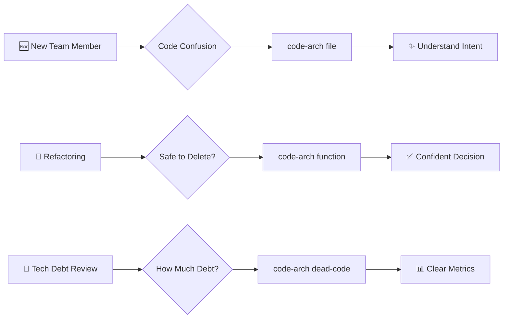
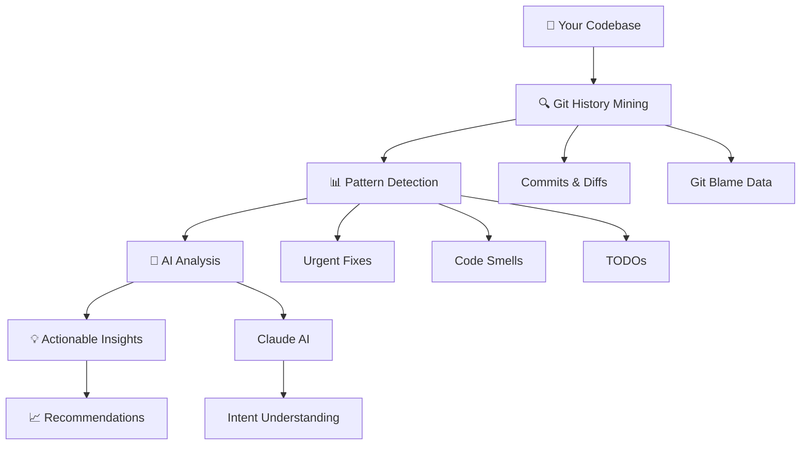

<div align="center">

<!-- Animated Header -->


<!-- Typing Animation -->
<a href="https://git.io/typing-svg"></a>

<br/>

<!-- Badges with Animation -->
<p align="center">
  
  
  
  
</p>

<!-- Social Proof -->
<p align="center">
  
  
  
</p>

<!-- Quick Links with Icons -->
<p align="center">
  <a href="#-features">Features</a> •
  <a href="#-installation">Installation</a> •
  <a href="#-usage">Usage</a> •
  <a href="#-examples">Examples</a> •
  <a href="#-contributing">Contributing</a>
</p>

<br/>

<!-- Animated Divider -->


</div>

<br/>

## 🌟 What is Code Archaeologist?

<table>
<tr>
<td width="50%">

Ever inherited a mysterious codebase and thought:

> **"WTF is this code doing here?"** 🤔

Code Archaeologist is your AI-powered time machine that excavates Git history to tell you the **story behind your code**, not just what it does.

</td>
<td width="50%">

```bash
$ code-arch file legacy.js

🤖 AI Analysis:
This file was a rushed hotfix
during the Safari 15 rollout.
Originally temporary, it became
permanent due to time constraints.

⚠️  8 urgent commits detected!
💡 Recommend: Refactor ASAP
```

</td>
</tr>
</table>

<br/>

## ✨ Features

<div align="center">

| 🔍 **File Analysis** | ⚡ **Function Deep Dive** | 🪦 **Dead Code Detection** |
|:---:|:---:|:---:|
| Understand file creation<br/>and evolution story | AI-powered insights on<br/>specific functions | Find forgotten code<br/>gathering dust |
| **🏛️ Repository Overview** | **🤖 AI-Powered Insights** | **📊 Rich Statistics** |
| Bird's-eye view of<br/>codebase health | Claude analyzes commit<br/>patterns & intent | Track changes, contributors,<br/>& technical debt |

</div>

<details>
<summary><b>🎯 Click to see feature highlights!</b></summary>

<br/>

- ✅ **Smart Pattern Detection** - Identifies urgent fixes, TODOs, and code smells automatically
- ✅ **Multi-Language Support** - Works with any Git-tracked files
- ✅ **Actionable Recommendations** - Not just data, but what to *do* about it
- ✅ **Beautiful CLI Output** - Color-coded, emoji-rich, terminal-friendly
- ✅ **Fast & Lightweight** - Minimal dependencies, maximum speed
- ✅ **Configurable** - Customize thresholds, exclusions, and AI behavior

</details>

<br/>

<div align="center">

</div>

## 🚀 Installation

<table>
<tr>
<td>

### Global Installation (Recommended)

```bash
npm install -g code-archaeologist
```

</td>
<td>

### Local Development

```bash
git clone https://github.com/koushik4475/code-archaeologist.git
cd code-archaeologist
npm install
npm link
```

</td>
</tr>
</table>

**Requirements:** Node.js ≥ 16.0.0, Git installed

<br/>

## 📖 Usage

### 🎬 Quick Start Demo

```bash
# Analyze a mysterious file
code-arch file src/components/UserAuth.js

# Deep dive into a function
code-arch function src/utils/validator.js validateEmail

# Find dead code
code-arch dead-code src/ --recursive --threshold 365

# Repository health check
code-arch repo --since 2023-01-01
```

<br/>

<details open>
<summary><h3>🔍 File Analysis - Example Output</h3></summary>

```bash
$ code-arch file src/components/UserAuth.js

🔍 Excavating src/components/UserAuth.js...

┌─────────────────────────────────────────────────────────────┐
│  📄 File Analysis: src/components/UserAuth.js               │
└─────────────────────────────────────────────────────────────┘

📊 Metadata
  Created: 2022-03-15 by Alice Chen
  Last Modified: 2024-01-28 (3 days ago)
  Total Commits: 23
  Unique Authors: 4

📈 Statistics
  Lines Added: 456
  Lines Removed: 234
  Avg Change Size: 30 lines
  Change Velocity: high (3.2 commits/month)

🤖 AI Analysis
━━━━━━━━━━━━━━━━━━━━━━━━━━━━━━━━━━━━━━━━━━━━━━━━━━━━━━━━━━
This file was created as a rushed hotfix for a critical 
authentication bug discovered during the Safari 15 rollout. 
Initially intended as a temporary workaround, it became 
permanent due to time constraints. The high number of bug 
fixes (8 urgent commits) suggests unclear requirements 
around OAuth token handling.
━━━━━━━━━━━━━━━━━━━━━━━━━━━━━━━━━━━━━━━━━━━━━━━━━━━━━━━━━━

⚠️  Code Smells Detected
  🔴 panic_driven: Found 8 urgent/hotfix commits
     • 2023-11-20 (a3f2c1b): URGENT: Fix Safari cookie issue
     • 2023-09-14 (7bd4e8a): HOTFIX: OAuth token expiry bug

💡 Recommendations
  🔴 high_churn: High change frequency - indicates instability
  🔴 technical_debt: Review and refactor recommended
```

</details>

<details>
<summary><h3>⚡ Function Analysis - Example Output</h3></summary>

```bash
$ code-arch function src/utils/validator.js validateEmail

⚡ Function Analysis: validateEmail

📍 Location
  File: src/utils/validator.js
  Lines: 45-67 (23 lines)

📊 Metrics
  Complexity: Medium (7)
  Contributors: 3
  Stability: Unstable (many changes)
  Last Modified: 2024-01-15

🤖 AI Analysis
━━━━━━━━━━━━━━━━━━━━━━━━━━━━━━━━━━━━━━━━━━━━━━━━━━━━━━━━━━
Originally a simple regex check, this function evolved into 
a complex validator after multiple edge cases were discovered 
(international domains, plus addressing). The 12 commits 
suggest requirements weren't clear initially.
━━━━━━━━━━━━━━━━━━━━━━━━━━━━━━━━━━━━━━━━━━━━━━━━━━━━━━━━━━

💡 Recommendations
  🟡 stability: 12 commits - unclear requirements
  🔴 quality: 4 urgent fixes - needs testing
```

</details>

<details>
<summary><h3>🪦 Dead Code Detection - Example Output</h3></summary>

```bash
$ code-arch dead-code src/ --recursive --threshold 365

🪦 Scanning for dead code in src/...

┌─────────────────────────────────────────────────────────────┐
│  💀 Dead Code Scan Results                                  │
└─────────────────────────────────────────────────────────────┘

📊 Summary
  Total Files Scanned: 87
  Dead Code Files: 12 (13.8%)
  Suspicious Files: 8
  Active Files: 67

🔴 Top 10 Dead Files
┌───────────────────────────────┬────────────┬──────────┬──────────────┐
│ File                          │ Last Mod   │ Days Ago │ Author       │
├───────────────────────────────┼────────────┼──────────┼──────────────┤
│ src/legacy/parser.js          │ 2021-04-12 │ 987      │ Bob Williams │
│ src/utils/deprecated.js       │ 2021-08-20 │ 857      │ Alice Chen   │
│ src/old/formatter.js          │ 2022-01-05 │ 723      │ Carol Davis  │
└───────────────────────────────┴────────────┴──────────┴──────────────┘

💡 Potential Savings: ~1,247 lines of code
```

</details>

<br/>

<div align="center">

</div>

## 🎯 Use Cases

<div align="center">



</div>

<table>
<tr>
<td width="50%">

### 👨‍💻 Developer Scenarios

1. **Onboarding** - "Why does this exist?"
   ```bash
   code-arch file src/auth/oauth.js
   ```

2. **Refactoring** - "Is this safe to delete?"
   ```bash
   code-arch function src/legacy.js oldAPI
   ```

3. **Code Review** - "What's the context?"
   ```bash
   code-arch file src/payment.js --depth 50
   ```

</td>
<td width="50%">

### 🏢 Team Scenarios

1. **Tech Debt Assessment**
   ```bash
   code-arch dead-code src/ --recursive
   ```

2. **Sprint Retrospectives**
   ```bash
   code-arch repo --since 2024-01-01
   ```

3. **Quality Metrics**
   ```bash
   code-arch repo --top 10
   ```

</td>
</tr>
</table>

<br/>

## 🏗️ How It Works

<div align="center">



</div>

<br/>

**The Magic Behind the Scenes:**

1. 🔎 **Git Mining** - Extracts commits, diffs, and blame data
2. 🧩 **Pattern Recognition** - Identifies urgent fixes, TODOs, smells
3. 🧠 **AI Understanding** - Claude analyzes *why*, not just *what*
4. 💎 **Insight Generation** - Actionable recommendations

<br/>

<div align="center">

</div>

## ⚙️ Configuration

Create `.code-arch.json` in your project root:

```json
{
  "excludePaths": [
    "node_modules",
    "dist",
    "build",
    ".git"
  ],
  "defaultDepth": 20,
  "deadCodeThreshold": 365,
  "aiProvider": "anthropic",
  "complexityThreshold": 10,
  "hotspotMinCommits": 15
}
```

<details>
<summary><b>📋 Configuration Options</b></summary>

| Option | Type | Default | Description |
|--------|------|---------|-------------|
| `excludePaths` | Array | `[]` | Directories to ignore |
| `defaultDepth` | Number | `20` | Default commit history depth |
| `deadCodeThreshold` | Number | `365` | Days before code is "dead" |
| `aiProvider` | String | `anthropic` | AI service provider |
| `complexityThreshold` | Number | `10` | Max acceptable complexity |
| `hotspotMinCommits` | Number | `15` | Min commits for hotspot |

</details>

<br/>

## 🤝 Contributing

<div align="center">

We ❤️ contributions! Here's how you can help make Code Archaeologist even better:

</div>

```bash
# 1. Fork the repo
# 2. Create your feature branch
git checkout -b feature/amazing-feature

# 3. Commit your changes
git commit -m '✨ Add amazing feature'

# 4. Push to the branch
git push origin feature/amazing-feature

# 5. Open a Pull Request
```

<div align="center">

[](https://github.com/koushik4475/code-archaeologist/graphs/contributors)

</div>

<br/>

## 📊 Project Stats

<div align="center">


</div>

<br/>

<div align="center">

</div>

## 🙏 Acknowledgments

<table>
<tr>
<td align="center" width="33%">
<br/>
<b>simple-git</b><br/>
<sub>Git operations</sub>
</td>
<td align="center" width="33%">
<br/>
<b>Anthropic Claude</b><br/>
<sub>AI-powered insights</sub>
</td>
<td align="center" width="33%">
<br/>
<b>Node.js</b><br/>
<sub>Runtime environment</sub>
</td>
</tr>
</table>

<div align="center">

**Special thanks to all developers who've inherited legacy code and survived! 💪**

</div>

<br/>

## 📜 License

<div align="center">

MIT License © 2024 [Koushik](https://github.com/koushik4475)

See [LICENSE](LICENSE) file for details

</div>

<br/>

## 🐛 Issues & Support

<div align="center">

Found a bug? Have an idea? We'd love to hear from you!

[](https://github.com/koushik4475/code-archaeologist/issues)
[](https://github.com/koushik4475/code-archaeologist/issues)
[](https://github.com/koushik4475/code-archaeologist/discussions)

</div>

<br/>

## 🌟 Show Your Support

<div align="center">

If Code Archaeologist helped you understand your codebase better, give it a ⭐!

It really helps the project grow! 🚀

<a href="https://github.com/koushik4475/code-archaeologist/stargazers">
  
</a>

</div>

<br/>

---

<div align="center">


**Made with ❤️ and ☕ by developers who've seen too much legacy code**

<sub>Now go excavate some mysteries! 🏛️✨</sub>

</div>
